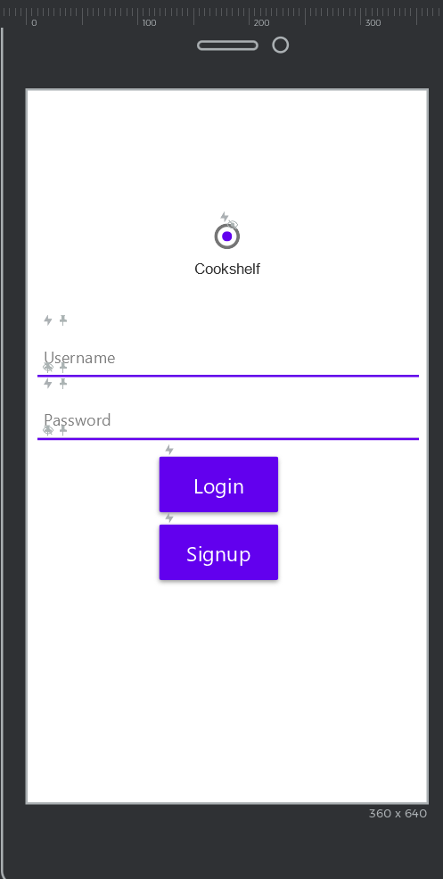

# cst438_s21_groupG_proj3

# Title
  Cookshelf 
# Goal
  The goal of Cookshelf is to provide a centralized application that allows users to create accounts that allow them to design and create their own unique and individualized recipes.
# Team:
  Justin Le
    [Github](https://github.com/JustLe56) 
    
  Karandeep Singh
    [Github](https://github.com/krndxs)
    
  Armon Bakhtar
    [Github](https://github.com/armonbakhtar1)
    
  Nayan Gupta
    [Github](https://github.com/NayanAGupta)
    
# MVP:
  At minimum, the application should allow users to create accounts and save from a list of predefined recipes. 
# Timeline: 
  From the 16 User Stories, we aim to complete 1 story per person per week. 
# Wireframes: 
  
  
  
  
  
  
  
  
  
# Technologies:
  Android Studio
  
  https://api2.bigoven.com/
